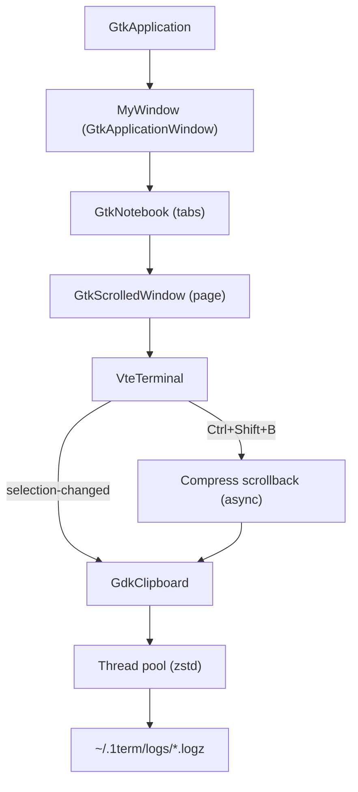

# 1term — Design

## High-Level Architecture

1term is a GTK 4 application that embeds a VTE terminal widget (GTK 4 build) inside a minimal tabbed UI. Rendering is handled by GTK 4’s renderer (GPU-accelerated where available); 1term’s code focuses on wiring VTE into a lightweight window, adding a small set of terminal-focused affordances (tabs, clipboard, scrollback utilities), and keeping the UI responsive under heavy output.

## Core Components

- `src/main.c`: Application entry point; configures `GtkApplication`, registers actions, and performs process-wide initialization/cleanup.
- `src/window.c` / `src/window.h`: Window construction and global UI settings (transparency/scrollback flags, CSS provider, notebook wiring, window controls).
- `src/tab.c` / `src/tab.h`: Tab lifecycle (create/close), VTE signal wiring, and tab/window title updates.
- `src/terminal.c` / `src/terminal.h`: VTE configuration (font, scrollback, feature toggles), keyboard shortcuts, selection-to-clipboard behavior, and PTY/shell spawning.
- `src/clipboard.c` / `src/clipboard.h`: Scrollback compression pipeline; reads clipboard text asynchronously and compresses/writes logs via a background thread pool.

## Data Flow

- Startup:
  - `main()` creates a `GtkApplication`.
  - On `activate`, `create_window()` constructs a `MyWindow` with a `GtkNotebook` and immediately calls `add_tab()` to create the first terminal.
- User input:
  - Most input goes directly to `VteTerminal`.
  - A `GtkEventControllerKey` attached to the terminal intercepts `Ctrl+Shift+…` shortcuts for app-level actions (new tab, close tab, toggle transparency/scrollback, compress scrollback, copy/paste).
- Terminal output:
  - The shell is spawned on a PTY and attached to `VteTerminal`, which handles escape sequences, rendering, and scrollback.
- Selection and clipboard:
  - On `selection-changed`, the selected text is fetched and written to the `GdkClipboard` (copy-on-select).
- Scrollback compression:
  - `Ctrl+Shift+B` selects all + copies to clipboard, then reads clipboard text asynchronously.
  - The clipboard contents are compressed with zstd in a thread pool and written atomically to `~/.1term/logs/terminal_*.logz`.

## Decision Log

- **GTK 4 + VTE (GTK 4 build)**: Uses GTK 4’s renderer and the GTK 4 VTE widget (`vte-2.91-gtk4`) to keep rendering efficient and avoid custom drawing paths.
- **Keep the main thread responsive**: Heavy work (scrollback compression) is dispatched to a `GThreadPool` rather than running in the UI thread.
- **Clipboard-based scrollback capture**: Scrollback compression is implemented via select-all/copy + clipboard read to reuse VTE’s text extraction and keep the interaction asynchronous.
- **Performance-oriented terminal defaults**: Features like bidi, shaping, sixel, and fallback scrolling are disabled by default to reduce overhead and improve predictability.
- **Hard-disable GTK accessibility bridge**: Environment variables (`GTK_A11Y=none`, `NO_AT_BRIDGE=1`) are set before GTK initialization to avoid accessibility infrastructure overhead (with the trade-off of reduced accessibility support).
