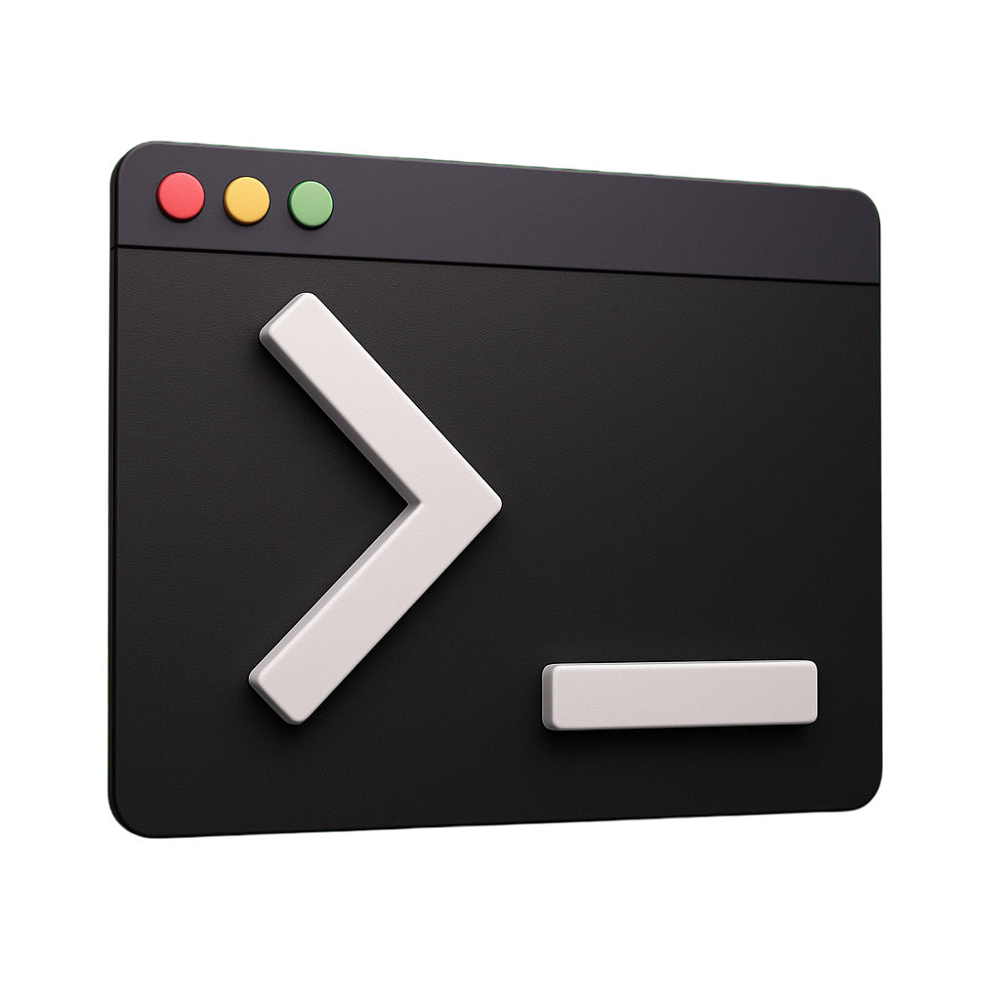

<div align="center">
  
</div>

<h1 align="center">1term - A Lightweight Terminal Emulator</h1>

<p align="center">
  A fast, minimal terminal emulator built with GTK4 and VTE
</p>

## ✨ Features

- **Tabbed Interface**: Multiple terminals in one window with tab management
- **Transparency Control**: Toggle window transparency on the fly
- **Scrollback Compression**: Save terminal history to compressed log files
- **Smart Clipboard**: Automatic copy-on-select with clipboard integration
- **Customizable**: Toggle scrollback, transparency, and other settings via keybindings
- **Lightweight**: Minimal dependencies, fast startup

## 🚀 Quick Start

### Install Dependencies

**Debian/Ubuntu:**
```bash
sudo apt install meson gcc pkg-config libgtk-4-dev libvte-2.91-gtk4-dev
```

**Fedora:**
```bash
sudo dnf install meson gcc pkg-config gtk4-devel vte291-gtk4-devel
```

**Arch Linux:**
```bash
sudo pacman -S meson gcc pkg-config gtk4 vte4
```

### Build and Install

```bash
# Clone the repository
git clone https://github.com/jopamo/1term.git
cd 1term

# Build
meson setup builddir --wipe
meson compile -C builddir

# Install (optional)
sudo meson install -C builddir
```

### Run

```bash
# From build directory
./builddir/1term

# If installed system-wide
1term
```

## ⌨️ Keybindings

All keybindings use **Ctrl+Shift** as modifiers.

| Key | Action | Description |
|-----|--------|-------------|
| `C` | Copy | Copy selected text to clipboard |
| `V` | Paste | Paste clipboard content |
| `A` | Select All | Select all text and copy to clipboard |
| `B` | Compress Scrollback | Save scrollback buffer to compressed log file |
| `T` | Toggle Transparency | Enable/disable window transparency |
| `S` | Toggle Scrollback | Enable/disable scrollback buffer |
| `N` | New Tab | Create a new terminal tab |
| `W` | Close Tab | Close current terminal tab |

**Note**: Scrollback files are saved to `~/.1term/logs/terminal_YYYYMMDD_HHMMSS_D.logz`

## 📁 Project Structure

For developers and contributors:

```
src/
├── main.c              # Application entry point
├── window.c/h          # Window management & UI
├── tab.c/h             # Tab management
├── terminal.c/h        # Terminal configuration
└── clipboard.c/h       # Clipboard & compression
```

## 🤝 Contributing

Contributions are welcome! Please see the [Development Guide](docs/DEVELOPMENT.md) for details on the codebase structure and build process.

## 📄 License

MIT License - see [LICENSE](LICENSE) file for details.

---

<p align="center">
  Made with ❤️ using GTK4 and VTE
</p>
